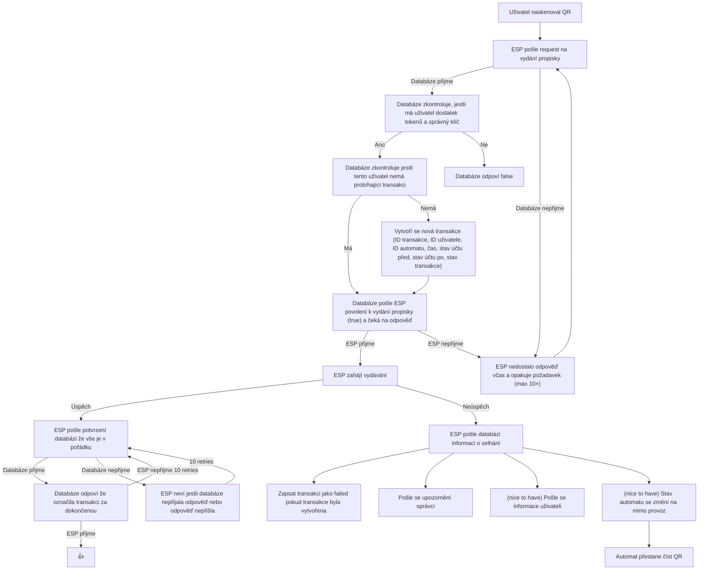

```mermaid
flowchart TD
    A["Uživatel naskenoval QR"]
    B["ESP pošle request na vydání propisky"]
    C["Databáze zkontroluje, jestli má uživatel dostatek tokenů a správný klíč"]
    D["Databáze zkontroluje jestli tento uživatel nemá probíhající transakci"]
    E["Databáze odpoví false"]
    F["Vytvoří se nová transakce (ID transakce, ID uživatele, ID automatu, čas, stav účtu před, stav účtu po, stav transakce)"]
    G["Databáze pošle ESP povolení k vydání propisky (true) a čeká na odpověď"]
    H["ESP zahájí vydávání"]
    I["ESP nedostalo odpověď včas a opakuje požadavek (max 10×)"]
    J["ESP pošle databázi informaci o selhání"]
    K["Pošle se upozornění správci"]
    L["(nice to have) Pošle se informace uživateli"]
    M["(nice to have) Stav automatu se změní na mimo provoz"]
    N["Automat přestane číst QR"]
    O["Zapsat transakci jako failed pokud transakce byla vytvořena"]
    P["ESP pošle potvrzení databázi že vše je v pořádku"]
    Q["Databáze odpoví že označila transakci za dokončenou"]
    R["ESP neví jestli databáze nepřijala odpověď nebo odpověď nepřišla"]
    U["👍"]

    A --> B
    B --> |Databáze přijme| C
    B --> |Databáze nepřijme| I
    C --> |Ano| D
    C --> |Ne| E
    D --> |Má| G
    D --> |Nemá| F
    F --> G
    G -->|ESP přijme| H
    G -->|ESP nepřijme| I
    I --> B
    H --> |Úspěch| P
    H --> |Neúspěch| J
    J --> O
    J --> K
    J --> L
    J --> M
    M --> N
    P --> |Databáze přijme| Q
    P --> |Databáze nepřijme| R
    Q --> |ESP přijme| U
    Q --> |ESP nepřijme 10 retries| P
    R --> |10 retries| P
```
