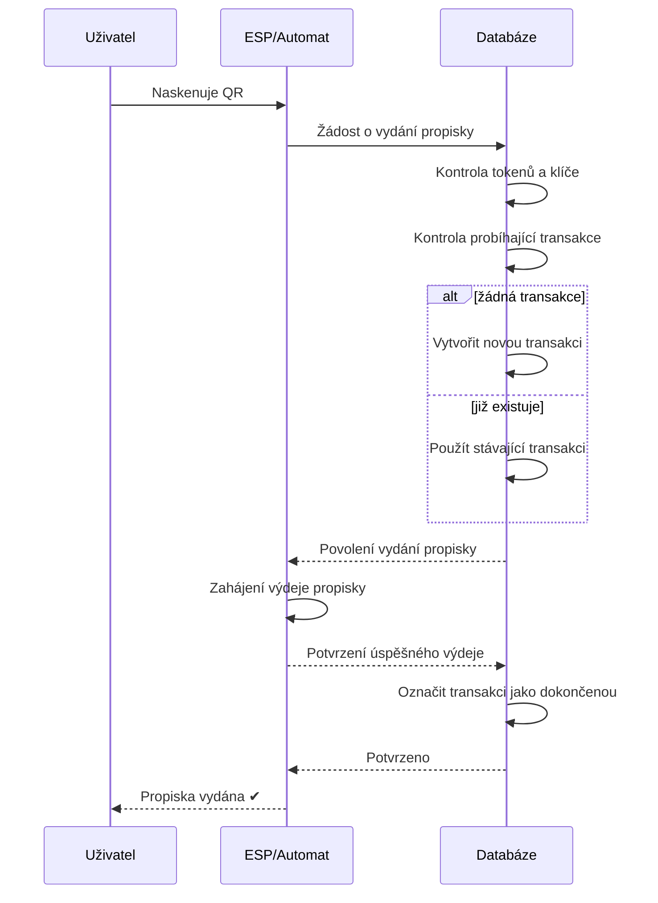
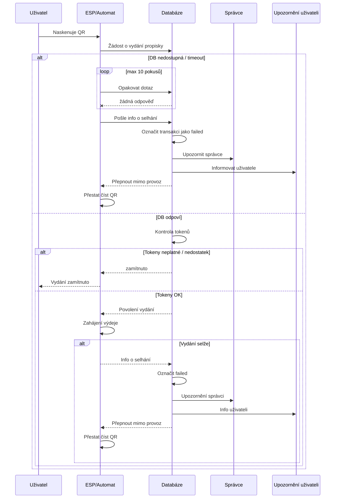

Happy:

```mermaid
sequenceDiagram
    participant U as Uživatel
    participant ESP as ESP/Automat
    participant DB as Databáze

    U->>ESP: Naskenuje QR
    ESP->>DB: Žádost o vydání propisky

    DB->>DB: Kontrola tokenů a klíče
    DB->>DB: Kontrola probíhající transakce
    alt žádná transakce
        DB->>DB: Vytvořit novou transakci
    else již existuje
        DB->>DB: Použít stávající transakci
    end

    DB-->>ESP: Povolení vydání propisky
    ESP->>ESP: Zahájení výdeje propisky

    ESP-->>DB: Potvrzení úspěšného výdeje
    DB->>DB: Označit transakci jako dokončenou
    DB-->>ESP: Potvrzeno

    ESP-->>U: Propiska vydána ✔
```
Error:

```mermaid
sequenceDiagram
    participant U as Uživatel
    participant ESP as ESP/Automat
    participant DB as Databáze
    participant Admin as Správce
    participant Notif as Upozornění uživateli

    U->>ESP: Naskenuje QR
    ESP->>DB: Žádost o vydání propisky

    alt DB nedostupná / timeout
        loop max 10 pokusů
            ESP->>DB: Opakovat dotaz
            DB--xESP: žádná odpověď
        end
        ESP->>DB: Pošle info o selhání
        DB->>DB: Označit transakci jako failed
        DB->>Admin: Upozornit správce
        DB->>Notif: Informovat uživatele
        DB-->>ESP: Přepnout mimo provoz
        ESP->>ESP: Přestat číst QR
    else DB odpoví
        DB->>DB: Kontrola tokenů
        alt Tokeny neplatné / nedostatek
            DB-->>ESP: zamítnuto
            ESP-->>U: Vydání zamítnuto
        else Tokeny OK
            DB-->>ESP: Povolení vydání
            ESP->>ESP: Zahájení výdeje
            alt Vydání selže
                ESP-->>DB: Info o selhání
                DB->>DB: Označit failed
                DB->>Admin: Upozornění správci
                DB->>Notif: Info uživateli
                DB-->>ESP: Přepnout mimo provoz
                ESP->>ESP: Přestat číst QR
            end
        end
    end
```
