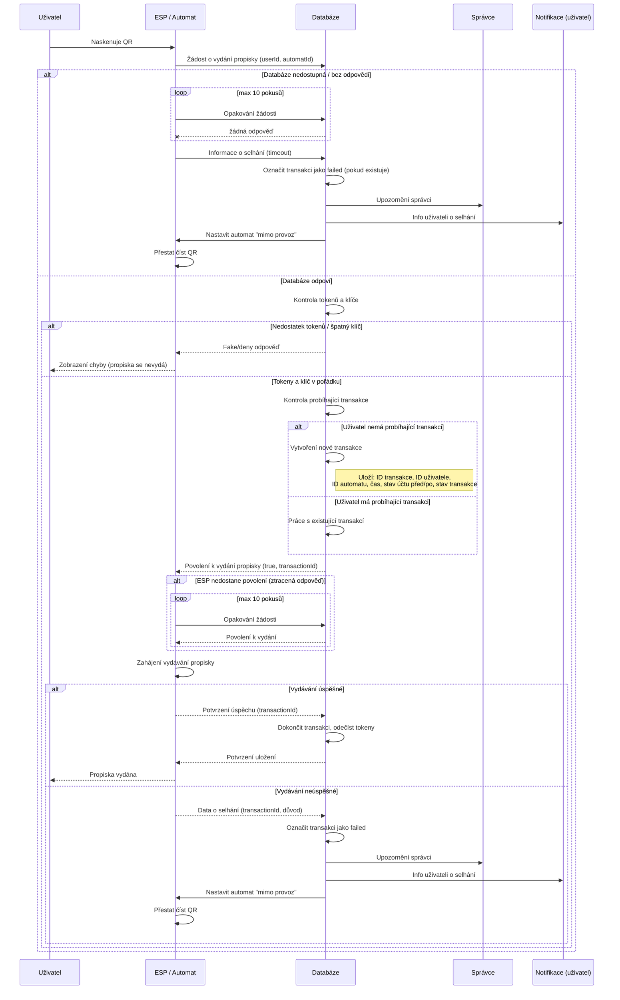

```mermaid
sequenceDiagram
    participant U as Uživatel
    participant ESP as ESP / Automat
    participant DB as Databáze
    participant Admin as Správce
    participant Notif as Notifikace (uživatel)

    U->>ESP: Naskenuje QR
    ESP->>DB: Žádost o vydání propisky (userId, automatId)

    alt Databáze nedostupná / bez odpovědi
        loop max 10 pokusů
            ESP->>DB: Opakování žádosti
            DB--xESP: žádná odpověď
        end
        ESP->>DB: Informace o selhání (timeout)
        DB->>DB: Označit transakci jako failed (pokud existuje)
        DB->>Admin: Upozornění správci
        DB->>Notif: Info uživateli o selhání
        DB->>ESP: Nastavit automat "mimo provoz"
        ESP->>ESP: Přestat číst QR
    else Databáze odpoví
        DB->>DB: Kontrola tokenů a klíče

        alt Nedostatek tokenů / špatný klíč
            DB-->>ESP: Fake/deny odpověď
            ESP-->>U: Zobrazení chyby (propiska se nevydá)
        else Tokeny a klíč v pořádku
            DB->>DB: Kontrola probíhající transakce

            alt Uživatel nemá probíhající transakci
                DB->>DB: Vytvoření nové transakce
                note right of DB: Uloží: ID transakce, ID uživatele,<br/>ID automatu, čas, stav účtu před/po, stav transakce
            else Uživatel má probíhající transakci
                DB->>DB: Práce s existující transakcí
            end

            DB-->>ESP: Povolení k vydání propisky (true, transactionId)

            alt ESP nedostane povolení (ztracená odpověď)
                loop max 10 pokusů
                    ESP->>DB: Opakování žádosti
                    DB-->>ESP: Povolení k vydání
                end
            end

            ESP->>ESP: Zahájení vydávání propisky

            alt Vydávání úspěšné
                ESP-->>DB: Potvrzení úspěchu (transactionId)
                DB->>DB: Dokončit transakci, odečíst tokeny
                DB-->>ESP: Potvrzení uložení
                ESP-->>U: Propiska vydána
            else Vydávání neúspěšné
                ESP-->>DB: Data o selhání (transactionId, důvod)
                DB->>DB: Označit transakci jako failed
                DB->>Admin: Upozornění správci
                DB->>Notif: Info uživateli o selhání
                DB->>ESP: Nastavit automat "mimo provoz"
                ESP->>ESP: Přestat číst QR
            end
        end
    end
```
